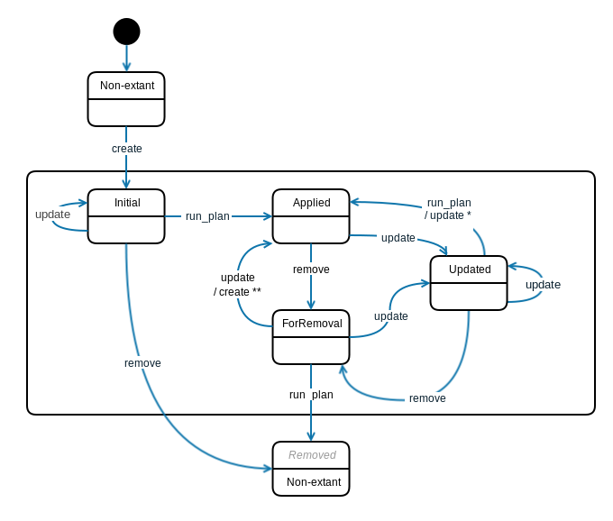
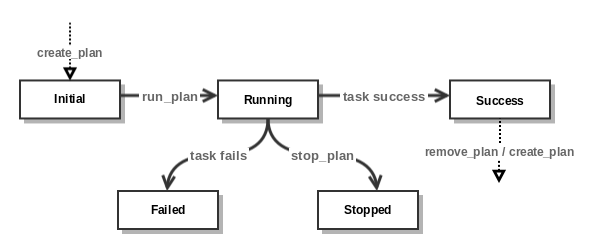
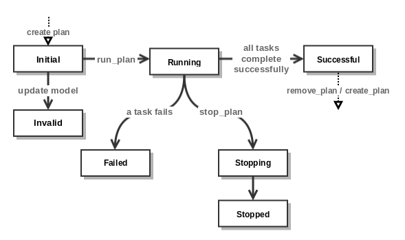

.. |external| raw:: html

   

.. _plugin_api:

Plugin API
==========

.. currentmodule:: litp.core.plugin

The tasks to be performed by LITP are determined by :dfn:`Plugins`. A plugin
is a Python class that extends class :class:`Plugin`.

.. _base-plugin-class:

Base Plugin class
-----------------

.. autoclass:: Plugin
    :members: create_configuration, create_lock_tasks, validate_model,
            validate_model_snapshot, get_security_credentials, create_snapshot_plan,
            update_model

The :func:`Plugin.create_configuration` method should create and return a list
of :class:`~litp.core.task.ConfigTask`,
:class:`~litp.core.task.RemoteExecutionTask`,
:class:`~litp.core.task.CallbackTask` or
:class:`~litp.core.task.OrderedTaskList` objects to be processed by the
execution manager.

The :func:`Plugin.create_lock_tasks` method should create and return a 2 item
tuple of :class:`~litp.core.task.ConfigTask`,
:class:`~litp.core.task.RemoteExecutionTask` or
:class:`~litp.core.task.CallbackTask` objects in the order of (lock_task,
unlock_task). The returned tasks will be used to lock and unlock the specific
node when some tasks need to be run while the node is locked.

The :func:`Plugin.validate_model` method allows you to provide
additional validation as required by the plugin, over and above the core model
and property validations. Typically this is used for cross-item validation,
(for example, libvirt plugin wants to check that there is a bridge configured
on the host node that is providing the virtualisation service).

The :func:`Plugin.get_security_credentials` method should be implemented by
a plugin, should it need to check the existence and validity of security
credential pairs (ex. username and password) for relevant types in the model.

The :func:`Plugin.create_snapshot_plan` method should create and return a list
of :class:`~litp.core.task.ConfigTask`,
:class:`~litp.core.task.RemoteExecutionTask`, and
:class:`~litp.core.task.CallbackTask` objects to be processed by the execution
manager to either create, remove or restore a snapshots.

The :func:`Plugin.update_model` method allows a plugin to modify the model
just before validation is performed. Its use is seldom required and so this
method is rarely implemented.

.. _accessing-the-deployment-model:

Accessing the Deployment Model
------------------------------

A plugin's implementation of :func:`Plugin.create_configuration`,
:func:`Plugin.update_model` and :func:`Plugin.validate_model` use the
Deployment Model as their input data.  This data is exposed by the Plugin
context API.

The Plugin Context API
**********************

.. currentmodule:: litp.core.plugin_context_api

The Deployment Manager exposes model information to the plugins in the form of
a context API as an instance of :class:`PluginApiContext` passed as an argument
to implementations of the
:func:`~litp.core.plugin.Plugin.create_configuration`,
:meth:`~litp.core.plugin.Plugin.update_model` and
:func:`~litp.core.plugin.Plugin.validate_model` methods:

.. currentmodule:: litp.core.plugin_context_api
.. autoclass:: PluginApiContext
   :members: get_password, query, query_by_vpath, snapshot_name,
        snapshot_action, snapshot_model

This API implements a :func:`PluginApiContext.query` method, which allows the
plugin author to locate items within the Deployment Model, access the
structural properties of those items and get information about their
state. Any item property or view can be used as search criteria.

Access to structural elements of returned items is via a dot based object
notation. For example, if a node item (:doc:`../item_types/node`) is returned
in a query, then ``node.storage_profile.filesystems`` provides access to an
iterable collection of filesystems. Access to item properties is also via
dot-notation.

The API instance has an ``exclude_nodes`` set. This is a set of
:class:`~litp.core.model_manager.QueryItem` instances for the relevant nodes
in the model. It is populated by the Execution Manager if a :ref:`create_a_snapshot`
or :ref:`remove_a_snapshot` request contains the optional ``exclude_nodes``
request parameter. ``exclude_nodes`` is validated against for non-named snapshots.
The set should be used by any plugins implementing :func:`Plugin.create_snapshot_plan`
so that named snapshots can be created ignoring these nodes.

.. _query-items:

Query Items
***********

The :func:`PluginApiContext.query` method returns an iterable sequence of all
items in the Deployment Model that match the ItemType and the properties given as
parameters. Each match is returned in the form of an instance of
:class:`~litp.core.model_manager.QueryItem`:

.. note::
    The ordering of model items returned from the query is not defined.

.. currentmodule:: litp.core.model_manager

.. autoclass:: QueryItem
   :members: query, clear_property,
        get_ancestor, get_cluster, get_ms, is_cluster, is_ms, is_node, query_by_vpath, is_removed,
        get_state, get_source, get_vpath, get_node, get_parent,
        parent, item_id, item_type, item_type_id, vpath,
        is_initial, is_applied, is_updated, is_for_removal,
        has_initial_dependencies, has_updated_dependencies, has_removed_dependencies,
        properties, applied_properties_determinable, applied_properties

.. currentmodule:: litp.core.plugin_context_api

The Snapshot Model API
**********************

The model existing at the time of a snapshot creation is exposed by
:func:`PluginApiContext.snapshot_model` through
:class:`~litp.core.snapshot_model_api.SnapshotModelApi`.

.. autoclass:: litp.core.snapshot_model_api.SnapshotModelApi
   :members: query, query_by_vpath

.. seealso::
   :ref:`accessing-snapshot-data`

.. _state-diagram:

Model Item State Diagram
************************

The following diagram shows the state life cycle of LITP model items:

+---------------+-----------------------+--------------+----------------------------------------------------------------------------------------+
| STATE         | INPUT (CLI)           | NEXT STATE   | OUTPUT                                                                                 |
+===============+=======================+==============+========================================================================================+
| \-            | create                | "Initial"    | A new model Item is created.                                                           |
+---------------+-----------------------+--------------+----------------------------------------------------------------------------------------+
| "Initial"     | update                | "Initial"    | The item remains in same state.                                                        |
+---------------+-----------------------+--------------+----------------------------------------------------------------------------------------+
| "Initial"     | remove                | \-           | The item will be removed from the model.                                               |
+---------------+-----------------------+--------------+----------------------------------------------------------------------------------------+
| "Initial"     | create_plan; run_plan | "Applied"    | | All associated task(s) with item have completed successfully.                        |
|               |                       |              | | (A copy of the applied properties are taken)                                         |
+---------------+-----------------------+--------------+----------------------------------------------------------------------------------------+
| "Applied"     | update                | "Updated"    | A property has been updated or removed.                                                |
+---------------+-----------------------+--------------+----------------------------------------------------------------------------------------+
| "Applied"     | remove                | "ForRemoval" | The item will be marked for removal.                                                   |
+---------------+-----------------------+--------------+----------------------------------------------------------------------------------------+
| "Updated"     | update                | "Updated"    | A property has been updated or removed.                                                |
+---------------+-----------------------+--------------+----------------------------------------------------------------------------------------+
| "Updated"     | update                | "Applied"    | | The item is updated back to match its previously applied properties.                 |
|               |                       |              | | * Updating an item in a "Updated" state can revert it to a an "Applied" state        |
|               |                       |              | | if the updated properties match those which have been previously applied.            |
+---------------+-----------------------+--------------+----------------------------------------------------------------------------------------+
| "Updated"     | create_plan; run_plan | "Applied"    | | All associated task(s) with item have completed successfully.                        |
|               |                       |              | | (A copy of the applied_properties are taken)                                         |
+---------------+-----------------------+--------------+----------------------------------------------------------------------------------------+
| "Updated"     | remove                | "ForRemoval" | The item will be marked for removal.                                                   |
+---------------+-----------------------+--------------+----------------------------------------------------------------------------------------+
| "ForRemoval"  | update                | "Updated"    | | Properties were updated to add the item back into the model,                         |
|               |                       |              | | where the item's properties are now different to it's applied properties.            |
+---------------+-----------------------+--------------+----------------------------------------------------------------------------------------+
| "ForRemoval"  | update / create       | "Applied"    | | ** A "ForRemoval" item which is re-created or updated with its original properties,  |
|               |                       |              | | will be restored to the model in it's state prior to being set "ForRemoval"          |
+---------------+-----------------------+--------------+----------------------------------------------------------------------------------------+
| "ForRemoval"  | create_plan; run_plan | "Removed"    | | The item successfully removed from the model.                                        |
|               |                       |              | | ("Removed" is a temporary state before an item is completely removed from the model. |
|               |                       |              | | Note: The "Removed" state is not one which a plugin should be concerned with.)       |
+---------------+-----------------------+--------------+----------------------------------------------------------------------------------------+

Plugin Validation
-----------------

Before a Plugin can generate tasks, it should ensure that the Deployment Model
is in a state where the plugin can make use of its data. This validation step
occurs at plan creation time, after the Execution Manager has validated that
cardinality requirements are met.

In particular, plugin validation should ensure that the domain-specific
requirements that exist across different items in the Deployment Model are met.

.. currentmodule:: litp.core.plugin

Cross-item validation is performed by a plugin's implementation of
:func:`Plugin.validate_model`. This method returns a list of
:class:`~litp.core.validators.ValidationError` objects, with an empty list
signifying that validation has been successful.

For more information on the implementation of plugin validation, see
:doc:`../plugin_sdk/validation`.

.. _config-tasks:

.. currentmodule:: litp.core.task

Configuration Tasks
-------------------

Configuration tasks are tasks that the Deployment Manager will pass to
the Configuration Manager (Puppet). The plugin creates these tasks by
constructing :class:`ConfigTask` objects.

.. autoclass:: ConfigTask
   :members: __init__

The ``call_type`` and ``call_id`` parameters are used to identify the
configuration task types as they are handled by Puppet (the Puppet resource
that is associated with a given LITP item).

Puppet has a definition of resource as defined below:

.. epigraph::
   "Resources are the fundamental unit for modelling system
   configurations. Each resource describes some aspect of a
   system, like a service that must be running or a package
   that must be installed."
   -- Puppet Documentation

Every puppet resource has a type, a title and a set of key/value attributes::

        type {'title':
                attribute1 => value1,
                attribute2 => value2,
                ...
        }

The ``call_type`` attribute of a :class:`ConfigTask` object equates to the
Puppet *type* of the resource.

The ``call_id`` attribute of a :class:`ConfigTask` task equates to the *title*
of the Puppet resource it defines.

The title of a Puppet resource is an identifying string. It only has to
identify the resource to Puppet’s compiler. It does not need to bear any
relationship to the actual target system.

Titles must be unique per resource type. There may exist both a package and a
service titled “ntp” but there may only be one service titled “ntp”. Duplicate
titles will cause a compilation failure.

The ``kwargs`` property of a :class:`ConfigTask` Task, which map to a Puppet
resource's attributes, can optionally contain a :class:`FuturePropertyValue`
object. This can be used by plugin developers to generate puppet manifests from
:class:`ConfigTask` tasks using property values that are updated during the
running plan.

.. autoclass:: FuturePropertyValue
   :members: __init__

Please refer to :ref:`future-property-value-plugin` for more information
on how to use the :class:`FuturePropertyValue` class.

You can configure a :class:`ConfigTask` to replace an existing persisted
:class:`ConfigTask`, therefore enabling the replacement of the Puppet resource
defined by the existing :class:`ConfigTask`.
To do so, add (``call_type``, ``call_id``) tuples to the
:attr:`ConfigTask.replaces` set attribute of the :class:`ConfigTask` generated
in the plugin’s :meth:`~litp.core.plugin.Plugin.create_configuration` method.

The task being generated will then replace all previously applied Puppet
resources matching the type/id pairs in its ``replaces`` set, provided these
two conditions are met:

#. No :class:`ConfigTask` has been generated in the plan for the same node
   with a ``call_type`` and ``call_id`` that match any of the tuples
   present in a replacement configuration tasks's ``replaces`` attribute.

#. For a given node, there is no more than one :class:`ConfigTask` in the plan
   being generated that has a given ``(call_type, call_id)`` tuple in its
   ``replaces`` attribute.

If either or both of these conditions isn't met, plan creation will fail.

.. note::
   When a :class:`ConfigTask` that replaces a previously applied configuration
   task using this mechanism is successfully executed, the new task's dependencies
   supercede the old task's.

   If the new task's execution fails, the replaced tasks' Puppet resources are
   restored along with their dependencies.

.. _callback-tasks:

.. currentmodule:: litp.core.task

Callback Tasks
--------------

Callback tasks provide a means for you to expose a method of the
plugin as a task to the LITP Deployment Manager to be executed on behalf
of the plugin at the appropriate time in the execution of a plan.

The plugin creates callback tasks by constructing :class:`CallbackTask`
objects. In particular, an instance of :class:`CallbackTask` is given a
callback method when it is constructed - this is the method that will be
run by the Execution Manager on the Management Server to implement the task.

.. autoclass:: CallbackTask
   :members: __init__

Callback methods
****************

The methods that implement a callback task are provided with an API by the
Execution Manager. In order to allow for this, callback methods *must* take an
instance of :class:`~litp.core.callback_api.CallbackApi` as the first argument
in their signature:

.. currentmodule:: None
.. py:function:: callback_method_name(self, callback_api, *args, **kwargs)

The Execution Manager will check that all other arguments in the callback
method are based on native Python types, such as ``str``, ``int``, ``list`` or
``dict``.

.. warning::
  A callback method must not use plugin attributes (self.*) which are
  initialised in the plugin's implementation of the create_configuration or
  validate_model methods as this data may not be available when the callback
  method is called.

For more information on the use of callback methods, see
:ref:`using_callback_tasks`.

The Callback API
****************

The purpose of the the Callback API is to allow the callback method to access
certain core features of LITP.

.. autoclass:: litp.core.callback_api.CallbackApi
   :members: get_password,is_running,query, query_by_vpath ,rpc_command,sanitize

.. currentmodule:: litp.core.callback_api

.. note::
  Plugins *must* process any string read from the deployment model or security
  credential store through :func:`CallbackApi.sanitize` before issuing it on a
  shell's command line.

.. currentmodule:: litp.core.task

.. _remote-execution-tasks:

Remote Execution Tasks
----------------------

Remote execution tasks allow a plugin author to trigger non-configuration
actions on a set of nodes using an MCollective agent.

LITP uses MCollective to execute these actions in parallel on the specified
nodes. For example, the snapshot 
agent creates a snapshot of all logical volumes in each node.

MCollective provides a simple means of defining RPC agents. For more
information, refer to the official MCollective documentation at:

- `Writing SimpleRPC Agents <http://docs.puppetlabs.com/mcollective/simplerpc/agents.html>`_ |external|
- `Data Definition Language <http://docs.puppetlabs.com/mcollective/reference/plugins/ddl.html>`_ |external|
- `Aggregate Plugins <http://docs.puppetlabs.com/mcollective/reference/plugins/aggregate.html>`_ |external|

Store agent files in the following directory within the
plugin: ``puppet/mcollective_agents/files``

Files in this directory are automatically copied to the following directory on all
nodes on the next Puppet run: ``/opt/ericsson/nms/litp/etc/mcollective/mcollective``

For example, the snapshot agents use this absolute path: ``/ERIClitpvolmgr/puppet/mcollective_agents/files``

The agent is ready for use once the files have propagated to the nodes.

.. autoclass:: RemoteExecutionTask
   :members: __init__

The ``agent`` and ``action`` parameters with the given ``kwargs`` describe the
``mco rpc`` command that will be run on the specified ``nodes``.

.. _orderedtasklist-tasks:

.. currentmodule:: litp.core.task

OrderedTaskList Tasks
---------------------

:class:`OrderedTaskList` tasks allow a plugin author to create
a chain of tasks where each following becomes a dependency of the current one.

The list consists of instances of :class:`CallbackTask` and/or
:class:`ConfigTask` and all tasks within the list are executed in order of
occurrence in the list.

Once a plan is created with the ``litp create_plan`` command,
:class:`OrderedTaskList` is processed and each task adds its follower as a
dependency to its :func:`Task.requires` attribute. See :ref:`task-dependencies`

When an :class:`OrderedTaskList` contains tasks to be run on nodes or
Management Server that OrderedTaskList can only contain tasks for a single
node.  Mixing tasks for different nodes will result in
:class:`TaskValidationException`

.. autoclass:: OrderedTaskList
   :members: __init__

.. _task-state-diagram:

Task State Diagram
------------------

The following diagram shows the state lifecycle of LITP tasks:

+---------------+--------------------------------------------------------------------------------------------------------------------------------------------------------------+
| Task State    | Meaning                                                                                                                                                      |
+===============+==============================================================================================================================================================+
| "Initial"     | The task has been created, but not yet run.                                                                                                                  |
+---------------+--------------------------------------------------------------------------------------------------------------------------------------------------------------+
| "Running"     | The task is currently running.                                                                                                                               |
+---------------+--------------------------------------------------------------------------------------------------------------------------------------------------------------+
| "Success"     | The task completed successfully.                                                                                                                             |
+---------------+--------------------------------------------------------------------------------------------------------------------------------------------------------------+
| "Stopped"     | If there was a user-issued stop_plan command and the LITP service was subsequently killed, all unfinished tasks within the current phase are marked Stopped. |
+---------------+--------------------------------------------------------------------------------------------------------------------------------------------------------------+
| "Failed"      | The task failed.                                                                                                                                             |
+---------------+--------------------------------------------------------------------------------------------------------------------------------------------------------------+

.. _plan-state-diagram:

Plan State Diagram
------------------

The following diagram shows the state lifecycle of a LITP plan:

+---------------+--------------------------------------------------------------------------------------------------------------------------------------------------------------+
| Plan State    | Meaning                                                                                                                                                      |
+===============+==============================================================================================================================================================+
| "Initial"     | | The plan has been created and is ready to run.                                                                                                             |
|               | | While a plan is in this state:                                                                                                                             |
|               | | - You can update the model and recreate the plan.                                                                                                          |
|               | | - You can remove the plan.                                                                                                                                 |
|               | | - You can run the plan.The task has been created, but not yet run.                                                                                         |
+---------------+--------------------------------------------------------------------------------------------------------------------------------------------------------------+
| "Running"     | | The user issued the run_plan command, and the plan is now running.                                                                                         |
|               | | While a plan is in this state:                                                                                                                             |
|               | | - You can manually stop the running plan (using the stop_plan command).                                                                                    |
|               | | - You can **not** update the model.                                                                                                                        |
|               | | - You can **not** remove the plan.                                                                                                                         |
+---------------+--------------------------------------------------------------------------------------------------------------------------------------------------------------+
| "Stopping"    | | The plan is stopping due to a user-issued stop_plan command.                                                                                               |
|               | | While a plan is in this state:                                                                                                                             |
|               | | - You can **not** update the model.                                                                                                                        |
|               | | - You can **not** remove the plan.                                                                                                                         |
+---------------+--------------------------------------------------------------------------------------------------------------------------------------------------------------+
| "Stopped"     | | The plan has stopped due to a user-issued stop_plan command.                                                                                               |
|               | | **Note:** If there was a user-issued stop_plan command and the LITP service was subsequently killed,                                                       |
|               | |           all unfinished tasks within the current phase are marked "Stopped" and plan state is set to "Stopped".                                           |
|               | | While a plan is in this state:                                                                                                                             |
|               | | - You can update the model.                                                                                                                                |
|               | | - You can remove the plan.                                                                                                                                 |
|               | | - You can **not** run a "Stopped" plan.                                                                                                                    |
+---------------+--------------------------------------------------------------------------------------------------------------------------------------------------------------+
| "Successful"  | | All tasks in the plan ran and all tasks have a "Success" state. The stop_plan command was not used to stop the plan running.                               |
|               | | While a plan is in this state:                                                                                                                             |
|               | | - You can remove the plan.                                                                                                                                 |
+---------------+--------------------------------------------------------------------------------------------------------------------------------------------------------------+
| "Failed"      | | Some / all tasks in the plan ran, but one or more tasks have a "Failed" state. The stop_plan command was not used to stop the plan running.                |
|               | | While a plan is in this state:                                                                                                                             |
|               | | - You can remove the plan.                                                                                                                                 |
+---------------+--------------------------------------------------------------------------------------------------------------------------------------------------------------+
| "Invalid"     | | Changes were made to the model after this plan was created, so the plan now refers to an out-of-date model.                                                |
|               | | While a plan is in this state:                                                                                                                             |
|               | | - You can update the model.                                                                                                                                |
|               | | - You can create a new plan that takes account of changes to the model (using the create_plan command).                                                    |
|               | | - You can **not** run the plan.                                                                                                                            |
+---------------+--------------------------------------------------------------------------------------------------------------------------------------------------------------+

.. currentmodule:: litp.core.task

.. _task-dependencies:

Task Dependencies
-----------------

Individual instances of :class:`ConfigTask`, :class:`CallbackTask` and
:class:`RemoteExecutionTask` created within a plugin can optionally specify
dependencies against other tasks by adding the following to the task's
``requires`` set:

* instance of :class:`~litp.core.model_manager.QueryItem`
* tuple(ConfigTask.call_type, ConfigTask.call_id)
* instance of :class:`ConfigTask`, :class:`CallbackTask` or :class:`RemoteExecutionTask`

.. autoclass:: Task
   :members: requires

Information about dependencies is added to the dependency graph used during
topological sort.

Examples can be found at :ref:`setting-dependencies-tasks`.

Multiple Model Items Attached to Tasks
--------------------------------------

:class:`ConfigTask`, :class:`CallbackTask` and :class:`RemoteExecutionTask` can
specify zero or more extra model items they will determine the state of by
assigning a set of :class:`~litp.core.model_manager.QueryItem` instances to the
task's ``model_items`` attribute.

Model items contained in this property *do not* affect the task's order after
the task graph has been sorted topologically.

.. autoclass:: Task
   :members: model_items

.. seealso::
   :ref:`task-multiple-model-items`

Snapshotting
------------
A plugin can provide Callback tasks to create, restore or remove snapshots.

For more information on snapshotting, see :ref:`plugin_snapshot_api`.

Documenting Plugins
-------------------

.. currentmodule:: litp.core.plugin

Plugins are automatically picked up by the LITP documentation generator and
will appear in the following reference:

:doc:`../plugins/index`
    Complete documentation of LITP plugins

The content of the Sphinx documentation for plugins is derived from the
docstrings provided in the implementation of the :class:`Plugin` sub-class
('Overview' section), the implementation of the
:func:`Plugin.create_configuration` method ('Configuration/Usage' section) and
from the implementation of :func:`Plugin.validate_model` ('Validation'
section).

These docstrings are expected to make use of the ReStructuredText markup
language. A reference on the use of RST may be found `here
<http://sphinx-doc.org/rest.html>`_ |external|.

