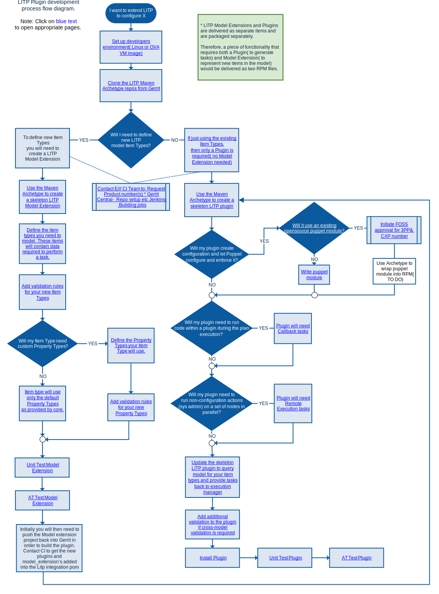

.. |external| raw:: html

   

LITP Plugin Developer's Guide
=================================

This guide provides the tools and information required to enable a developer to create a LITP plugin. It also includes information on creating LITP Model Extensions, which are often required by LITP plugins. The formally supported operating system for creating plugins and model extensions is Red Hat Enterprise Linux (RHEL) 6.6 but a derived operating system such as Scientific Linux 6.6 may also be used. The guide covers the setup of a developer environment and for those without access to a Linux environment, includes an ova image which can be used with VM software (such as Oracle VirtualBox).

Intended Audience
-----------------

The document is aimed at a developer who is typically an Ericsson or third party engineer who has a good knowledge of the LITP architecture.

Assumptions and Prerequisites
-----------------------------

To begin creating plugins for LITP you will need:

- A good knowledge of LITP (More information is available in the `LITP User Community <https://confluence-oss.lmera.ericsson.se/display/LITP2UC/LITP+User+Community+Home/>`_ |external| and :doc:`introduction`)
- A development environment (A guide is available at :doc:`env_setup`)
- Proficiency in the `Python <http://www.python.org>`_ |external| programming language
- Knowledge of the `Puppet <http://puppetlabs.com/>`_ |external| configuration enforcement tool
- Familiarity with the `Maven <https://maven.apache.org/index.html>`_ |external| build tool
  and `Project Object Model <https://maven.apache.org/guides/introduction/introduction-to-the-pom.html>`_ |external| files
- Familiarity with `Ruby <http://www.ruby-lang.org/>`_ |external| and `Marionette
  Collective <http://docs.puppetlabs.com/mcollective/>`_ |external| is required if the
  plugin is used to generate :ref:`remote-execution-tasks`.

.. note::
  For information on how to set up a development environment, see :doc:`env_setup`

Plugin Development Workflow
---------------------------

|

.. raw:: html

   <object data="../_images/plugin_development_workflow.svg" type="image/svg+xml">
       Your browser doesn't support SVG images
   </object>

Steps Involved in LITP Plugin Development:
------------------------------------------

#. :doc:`introduction`
#. :doc:`env_setup`
#. :ref:`env-maven-arch`
#. :doc:`model_extensions`
#. :doc:`plugin_methods`
#. :doc:`validation`
#. :doc:`plugin_testing`
#. :doc:`installation`
#. :doc:`dev_troubleshooting`

.. toctree::
  :hidden:

  introduction
  env_setup
  model_extensions
  plugin_methods
  plugin_testing
  validation
  installation
  dev_troubleshooting
  dependencies_and_requirements
  docker_setup
  ova_setup
  env-manual
  maven_archetypes
  maven_archetype_extension
  maven_archetype_plugin
  maven_archetype_puppet
