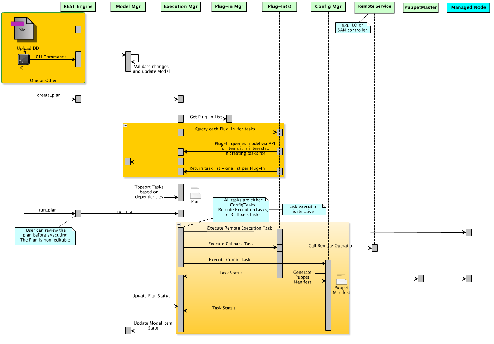
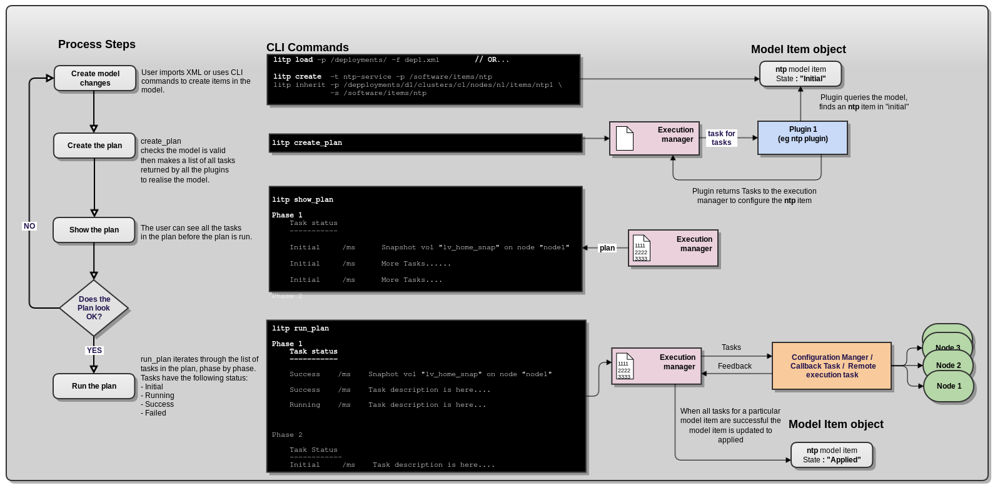
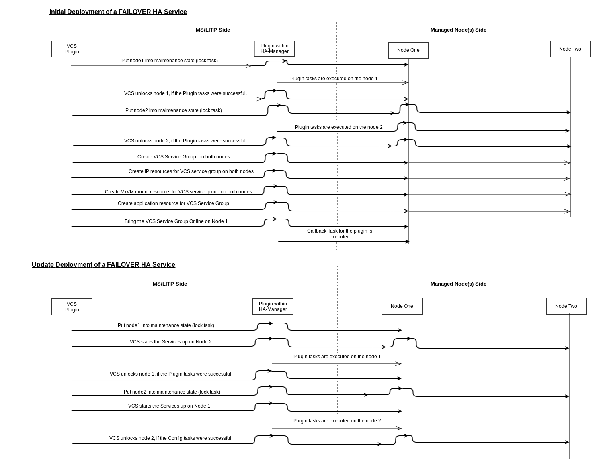

.. |external| raw:: html

   

.. |br| raw:: html

    

Introduction and Basic LITP Concepts
====================================

LITP is delivered as a core with a set of plugins.  LITP Core has
responsibility for the execution of install, upgrade and configuration
use-cases, based on deployment information configured by the user in the
Deployment Model.  Plugins provide configuration of the software and hardware
component parts of a deployment. For this, access to the Deployment Model is
provided by a read-only API provided by LITP core.

Plugins provide tasks to LITP's core Execution Manager, which 
then sorts these tasks based on the dependency information gleaned 
from the Deployment Model. The tasks are executed and the 
resource states are updated based on task completion status.

.. note:: As LITP Core is critical to the operation of LITP, changes or updates to core modules are not recommended and are not supported.

LITP Task Flow
^^^^^^^^^^^^^^
The diagram below shows how tasks are processed within LITP and Plug-ins.

A user creates a LITP model (aka Deployment Description) via CLI commands
or XML, which is then validated by the LITP Model Manager. Once valid, the
user can create a plan.

To make this Plan, the Execution Manager gets a list of currently active
plug-ins from the Plug-in Manager and queries each plug-in for tasks to
add to the Plan. Each plug-in queries / searches the Model via the
plug-in API for model items which concern it (and their respective states).
A plug-in will typically return tasks for these model items when it
finds them in a "Initial", "Updated" or "ForRemoval".

The tasks are returned to the LITP Execution Manager, which sorts them into
an plan with the order based on model or plug-in supplied dependencies. When
the user runs the plan, the Execution manager takes each task and executes
it. Depending on the task type (see :ref:`types-of-tasks`) it may run a
remote execution task on a remote service, callback to a method defined in
a plugin, or be passed to the Configuration Manger (Puppet). A feedback
mechanism allows the Execution Manager to track the status of the task, and
the running plan is updated accordingly. When all tasks for a particular
model item have been successful, the state of that model item will be
updated to "Applied".

Deployment Model
^^^^^^^^^^^^^^^^^
The LITP Deployment Model is the object model of a system held
in-memory. The model contains specific items used to configure
and deploy a specific implementation on a system. 
For more information, see: `Deployment Model <https://confluence-oss.lmera.ericsson.se/display/LITP2UC/Create+a+Deployment+Model>`_ |external|

LITP Process Steps
^^^^^^^^^^^^^^^^^^
The diagram below, shows a simplified view of the main process steps
within LITP, showing what happens when a user creates a model item,
creates a plan, shows the plan and runs the plan.

The example model item object illustrates a change of state from
"Initial" (when object is just created in the model) to "applied"
(when the tasks to realise this item in the physical deployment
have succeeded).

LITP Plugins
^^^^^^^^^^^^^
In LITP 2.x, plugins will extend the Management Server in terms
of what can be managed and configured at install and upgrade time. 
Plugins can generate three different types of task - configuration
tasks, callback tasks and remote execution tasks. In general,
these tasks are not mixed so plugins can be configuration
plugins, callback plugins or remote execution plugins.

Plugin developers should be aware that their tasks should be idempotent,
that is, their tasks should have no additional effect if they are run
by LITP more than once.
LITP uses a declarative model, we declare the state we want and this state
is realised by tasks in a plan. If the desired state is already realised when
the tasks to do it are run, then the tasks should leave it in that state. 

In the main, configuration tasks (Puppet as the underlying configuration
manager) are already idempotent, because Puppet will only make any changes
to the system if the system state does not match the configured state. 

Callback tasks and Remote execution tasks should therefore assume that the
desired state may already exist and code accordingly. 

The following sections describe the use of the configuration,
callback and remote execution tasks:

Using ConfigTasks to Create Puppet Resources
---------------------------------------------

A plugin is primarily responsible for marshalling data from the 
LITP Data Model into tasks so that the Execution manager will 
run those tasks and the task data is enforced into system 
configuration files. The data marshalled by a plugin into 
ConfigTasks is directly mapped to Puppet classes for Puppet 
enforcement into system configuration files. For any given Plan 
execution, a plugin can create and deliver many ConfigTasks for 
enforcement. ConfigTasks are the preferred mechanism within LITP 
for a plugin to affect system changes. The success or failure 
of a ConfigTask is determined from the asynchronous Puppet feedback mechanism.

.. note::
   An example of a Config Task is in the :ref:`sample-plugin`.

.. _using_callback_tasks:

.. currentmodule:: litp.core.task

Using Callback Tasks
--------------------
A :py:class:`CallbackTask` enables the execution of custom plugin logic when 
a direct Puppet enforcement path from data in the LITP Model 
to system configuration does not exist. The plugin creates a 
:py:class:`CallbackTask` with two key pieces of information:

#. A reference to the plugin function to be run by the Execution Manager
#. The associated set of data to be passed to the plugin callback function

The Callback Task run by the Execution Manager will not result in a Puppet 
manifest for enforcement. Instead the plugin callback function will be 
invoked and it must effect the system changes required. This function is 
free to carry out almost any action required. For example, connecting to 
remote 3PP systems to request external actions. A callback function may report 
failure to the Execution Manager by raising a 
:py:class:`CallbackExecutionException` exception.

.. note::
  Callback tasks can be used to edit item parameters in the model. No
  other tasks can do this.
  An example of a Callback Task is in the :ref:`sample-plugin`.

Using Remote Execution Tasks
----------------------------
A :py:class:`RemoteExecutionTask` enables the execution non-configuration
actions on a set of nodes using an MCollective agent.
MCollective agents execute these once off actions in parallel on the
specified nodes.
For example, these tasks allow a snapshot agent to create a snapshot of
all logical volumes in each node.

Tasksort
^^^^^^^^
The execution manager sorts tasks provided by the plugins into a plan,
which consists of a number of phases. Each phase contains a number of tasks.
When a plan is run the tasks in each phase are executed in sequence starting
with phase 1. Inside a phase, ConfigTasks may be executed in parallel when there
are no specified requires between them.
To ensure robustness of the plan, CallbackTasks and RemoteExecutionTasks 
are not included in the same phase as ConfigTasks. This prevents CallbackTasks
from interfering with the Puppet configuration phase by, for example, 
upgrading Puppet itself or rebooting nodes.

.. _task-ordering-derived:

How Task Ordering is Derived from the Model
-------------------------------------------
When a plan is being created, task execution order is determined based upon
the model item to which the task is associated (this is true of all task types).
For example, a task associated with a package model item on a node will be
executed after tasks to install the OS and configure networking on
that node (this sequencing is determined from the requires specified in
the "node" item type).

.. note::
  The model item with which a task is associated is typically the source for the
  configuration data for the task, although it may be the parent of a set of
  model items used in the Task or it may be an entirely independent model item.
  A task which uses configuration data from a number of model items should also
  specify these in the task's ``model_items`` attribute so that they are set to
  Applied when the task completes successfully.

Where possible, the model item which is the source of the configuration data
should be chosen as the model item to which the Task is associated.

Based upon a task's optional tag or the location of its associated item in the
model, it is sorted into one of the following groups:

#. ``DEPLOYMENT_MS_GROUP``
#. ``DEPLOYMENT_BOOT_GROUP``
#. ``DEPLOYMENT_PRE_NODE_CLUSTER_GROUP``
#. ``DEPLOYMENT_NODE_GROUP``
#. ``DEPLOYMENT_CLUSTER_GROUP``
#. ``POST_CLUSTER_GROUP``

Tasks belonging to the ``DEPLOYMENT_PRE_NODE_CLUSTER_GROUP``, ``DEPLOYMENT_NODE_GROUP`` or
``DEPLOYMENT_CLUSTER_GROUP`` groups are sorted on a cluster-by-cluster
basis in the plan.

For example, a task associated with a model item which is a child of the
management server is in the ``DEPLOYMENT_MS_GROUP`` whereas a task associated with
a model item under a node is in the ``DEPLOYMENT_NODE_GROUP``.

The way tasks are sorted into groups and how these groups are ordered are defined
in the *deployment ruleset*. A plugin can specify the group of a task by using
the tags defined by the ``deployment ruleset``. The following constraints apply to
using tags to specify the group of a task:

.. csv-table::
   :header: "Task Group", "Model Item Constraints", "Reason"
   :widths: 10, 20, 30

   "DEPLOYMENT_MS_GROUP", "If the task is a ConfigTask, then its node must be the MS. |br| Otherwise, its model item must not be under ``/deployments``.", "Tasks in this phase may be run before a given node has been installed. |br| Only the MS is guaranteed to be up and running and able to run CallbackTasks and ConfigTasks."
   "DEPLOYMENT_BOOT_GROUP", "If the task is a ConfigTask, then its node must be the MS. |br| Otherwise, its model item must not be under ``/deployments``.", "Tasks in this phase may be run before a given node has been installed. |br| Only the MS is guaranteed to be up and running and able to run CallbackTasks and ConfigTasks."
   "DEPLOYMENT_PRE_NODE_CLUSTER_GROUP", "If the task is a ConfigTask, then its node property is used for sorting. |br| Otherwise, its model item must either be an item of type cluster-base, or be a descendant of such an item.", "The plan builder sorts tasks in this group on a cluster-by-cluster basis. |br| In other words, the plan builder iterates on the items under the ``/deployments`` collection and, for each deployment, iterates on the items under that particular deployment item's clusters collection (this iteration is ordered in such a way that the cluster dependencies are honoured)."
   "DEPLOYMENT_NODE_GROUP", "If the task is a ConfigTask, then its node property is used for sorting. |br| Otherwise, its model item is expected to be an item of type node, or be a descendant of such an item.", "The plan builder sorts tasks in this group on a node-by-node basis if a HA manager is available on the cluster under which the nodes are defined. |br| If a HA manager is not available on the cluster, or a node under that cluster is in Initial state, then tasks pertaining to that node are sorted on a cluster-by-cluster basis. |br| In other words, the plan builder iterates on the items under the ``/deployments`` collection and, for each deployment, iterates on the items under that particular deployment item's clusters collection (this iteration is ordered in such a way that the cluster dependencies are honoured). |br| In turn, for each cluster, the plan builder sorts tasks on a node-by-node basis for nodes that can be locked and unlocked, then appends tasks for all other nodes."
   "DEPLOYMENT_CLUSTER_GROUP", "If the task is a ConfigTask, then its node property is used for sorting. |br| Otherwise, the task's model item must either be an item of type cluster-base, or be a descendant of such an item.", "The plan builder sorts tasks in this group on a cluster-by-cluster basis. |br| In other words, the plan builder iterates on the items under the ``/deployments`` collection and, for each deployment, iterates on the items under that particular deployment item's clusters collection (this iteration is ordered in such a way that the cluster dependencies are honoured)."
   "POST_CLUSTER_GROUP", "There are no constraints for tasks in this group.", "The plan builder sorts tasks in this group into phases based on task type. CallbackTasks and RemoteExecutionTasks are not included in the same phase as ConfigTasks."

For more information on using tags
to order tasks, see: :ref:`plugin_deployment_api`.

.. note::
  The *deployment ruleset* is available for import in plugins
  from :py:mod:`litp.plan_types.deployment_plan.deployment_plan_ruleset`.

.. note::
  It is only possible to specify a task's ``requires`` dependencies inside the
  scope of one of these groups.

Inside these groups, tasks are further sorted based upon requires
which are specified between child elements of defined model item types.

For example the "node" model item type specifies the following child elements
and requires between them::

 1. node/system
 2. node/os                 requires "system"
 3. node/network_interfaces requires "os"
 4. node/routes             requires "network_interfaces"
 5. node/storage_profile    requires "routes"
 6. node/file_systems       requires "storage_profile"
 7. node/configs            requires "file_systems"
 8. node/items              requires "file_systems"
 9. node/services           requires "file_systems"

The requires above will result in tasks being ordered as outlined inside
a "node" group. This results in tasks being ordered where a PXE boot task
associated with the "system" model item is executed before the tasks for the
OS install which are associated with the "os" model item and then these tasks
are followed by the tasks to configure network interfaces which are
associated with child elements of "network_interfaces"... etc.

.. note::
  Groups of ConfigTasks on a single node are combined into a single phase with
  the ordering of these tasks passed into puppet as puppet requires.

How Task Ordering is Derived from Tasks
---------------------------------------
In addition to ordering derived from the model requires, a task can specify
requires on other tasks on which it depends.
These requires can be specified in 3 different ways.

A plugin can specify that:

#. a task requires another task by providing the task.
#. a task requires all tasks associated with another model item by providing the model item.
#. a task requires a ConfigTask by specifying the ConfigTasks call_type and call_id

For more information on setting task dependencies, see: :ref:`setting-dependencies-tasks`

.. note::
  Any successful ConfigTasks in a failed Plan will not appear in the
  subsequent Plan, even if their model items aren't in an Applied state.
  Their absence will not affect ordering, which will be handled as if those
  tasks were there.

VCS Flowchart interaction with a LITP Plugin:
^^^^^^^^^^^^^^^^^^^^^^^^^^^^^^^^^^^^^^^^^^^^^
The following diagrams shows the sequence of flow between VCS, a plugin and two nodes
in a HA environment setup.

LITP Model Extensions
^^^^^^^^^^^^^^^^^^^^^^^
The LITP core defines a model object which contains the information it needs to 
configure the system. If a plugin needs to add data types to the model, it can 
achieve this by defining a Model Extension. The Model Extension contains the 
extra objects required by the plugin. Some plugins do not need to extend the
model. An example of this is the ERIClitphosts plugin which uses the hostname
property of the 'node' item type, defined in the core extension.
A Model Extension registers new data types with LITP. New PropertyTypes and
ItemTypes can be added and these may 
extend existing Types or may be brand new Type definitions.

The following example shows a sample definition for a new ItemType:

.. code-block:: python

        ItemType("system",....)

This is an example of a new ItemType that extends an existing ItemType: 

.. code-block:: python

        ItemType("blade", extend_item="system",..)

Once registered, instances of the new data types must be added into the existing 
Data Model. Once added, the new data types may be used by any plugin.
