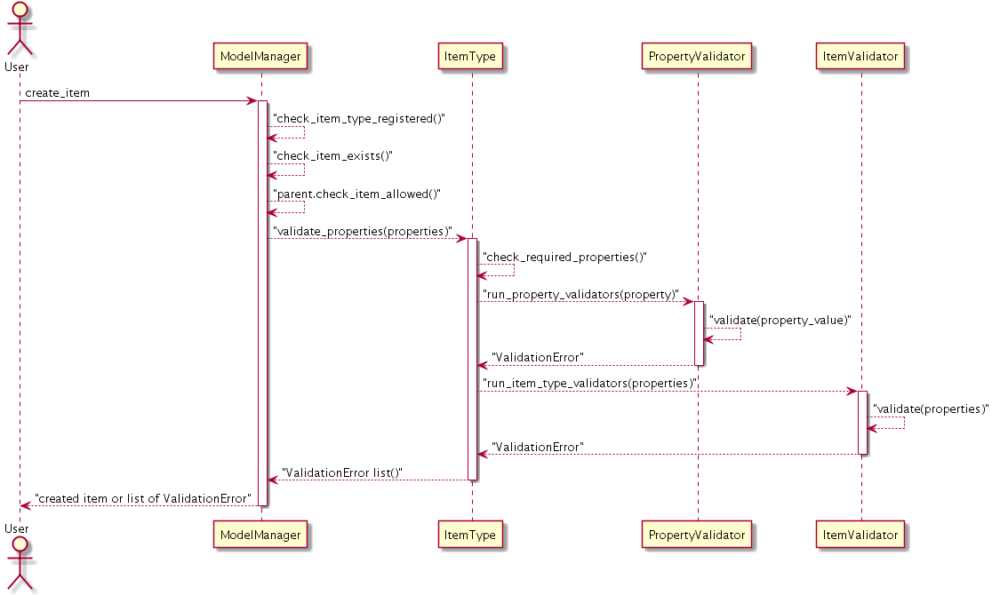
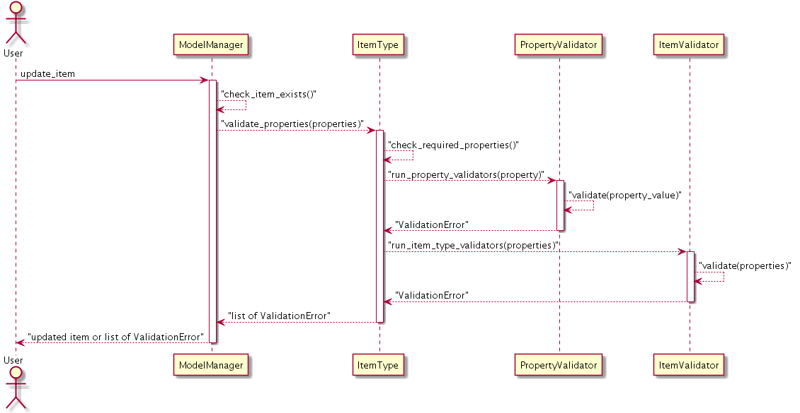
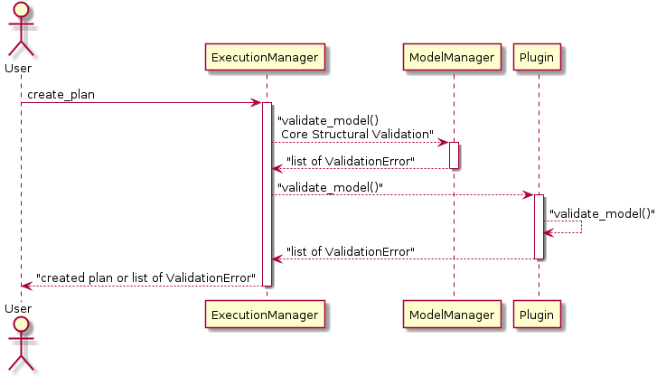

.. currentmodule:: litp.core.validators

Adding Validation
=================

LITP provides support for the following types of validation:

* `PropertyType Validators`_ - When defining a Property Type, a list of
  property validators can be specified. A property validator is a
  class instance with pre-defined validation for a property value. These
  validators are run against the property values at creation and update of
  an item.

* `ItemType Validators`_ - When defining a Item Type, a list of item
  validators can be specified. A item validator is a class instance with
  pre-defined validation for an item's properties. These validators
  are run against the properties of an item at creation and update.

* `Core / Structural Model Validation`_ - The Model Manager validates the
  model against the structure of the defined types. This will run at create
  plan and the user will be shown a list of validation errors.

* `Plugin Model Validation`_ - A plugin can provide its implementation of
  the :func:`litp.core.plugin.Plugin.validate_model` method to perform
  additional cross-model validation. For more information on
  the validate_model method please see below.

These different types allow for validation to be performed at different
granular layers. `PropertyType Validators`_ allow for validation on
a specific property value in isolation from the rest of the model (This
validation is performed at create or update of an item). An example property
validator would be to ensure that the value of a property is a valid IPV4 address.
`ItemType Validators`_ allow for validation on an item's set of properties in
isolation from the rest of the model (This is performed at create or update
of an item). An example is to validate that an item's 'start' property is
before the item's 'end' property. `Core / Structural Model Validation`_ is a type
check against the defined structure of an item type. It is requires no additional
code and is performed by the Model Manager at 'create_plan'.
`Plugin Model Validation`_  allows for
cross-item validation (This is performed at 'create_plan' across the whole
model). An example of plugin validation would be to validate that only one
package item with a given name exists in the model on a node, as it is not
possible to install 2 packages with different versions on a node.

PropertyType Validators
------------------------

In any Model Extension, when defining a new PropertyType, you are strongly
encouraged to define validation rules for the new PropertyType. The
validation rules will be imposed by the LITP core during an Item create
or update operation. The PropertyType validation rules can take two forms:

1. *Regular Expression*
   
   This form of validation performs syntactic checks on the value of a
   Property instance of this PropertyType. 
   
   Python regular expressions are expected. The regular expression must be
   anchored with a caret and dollar to ensure an exact match and not prefix or
   partial matches.

2. *Validator instances*
   
   Validators can be defined separately from the PropertyType definition. A list
   of Validator instances are passed to the PropertyType for execution
   whenever an Item is created/updated that contains a Property of that
   PropertyType.

The following is an example of a custom :class:`PropertyValidator`
(typically these are defined in a Model Extension, except for common validators
which are made available in LITP core):
   
.. code-block:: python

   class IPAddressValidator(PropertyValidator):
   
       def __init__(self, version="4"):
           """Checks property is a valid IP Address"""
           self.version = version

       def validate(self, property_value):
           try:
               address = IPAddress(property_value)
           except AddrFormatError:
               return ValidationError(
                   error_message="Invalid IPAddress value '%s'"
                                  % property_value
               )
           if str(address.version) != self.version and self.version != "both":
               return ValidationError(
                   error_message=("Invalid IPAddress value '%s' for IPV%s"
                                  % (property_value, self.version))
               )

The following is an example of the use of this :class:`PropertyValidator` when
defining an PropertyType:

.. code-block:: python

   PropertyType("ipv6_address", validators=[IPAddressValidator("6")])

.. seealso::

   :doc:`../plugin_api/validators`
     For more information on the built-in PropertyValidators

ItemType Validators
-------------------

In a model extension, when defining an Item Type, a list of validators can be
specified. These validators are run against the properties of an item at
creation and update.

The following is an example of a custom :class:`ItemValidator`
(typically these are defined in a Model Extension, except for common validators
which are made available in LITP core):

.. code-block:: python

   class PackageValidator(ItemValidator):
       """Custom ItemValidator for package item type."""

       def validate(self, properties):
           if 'release' in properties and 'version' not in properties:
               return ValidationError(
                   property_name="release",
                   error_type="MissingRequiredPropertyError",
                   error_message="Version must be specified"
                                 " if release is provided."
               )

The following is an example using this :class:`ItemValidator` when defining
an ItemType:

.. code-block:: python
  :emphasize-lines: 8

   ItemType("package",
            name=Property("basic_string", required=True,
                prop_description="Package name to install/remove"),
            version=Property("package_version",
                prop_description="Package version"),
            release=Property("any_string",
                prop_description="Package release"),
            validators=[PackageValidator()])

.. note::
   All Item Validators and Property Validators are run at create or update
   of an item. They should not make any assumptions about other validators,
   having passed or failed. For example, an item validator cannot
   assume that required properties are present on the item.

.. seealso::

   :doc:`../plugin_api/validators`
     For more information on the built-in ItemValidators

Core / Structural Model Validation
-----------------------------------

Core Model validation is performed based upon the structure of the defined
item types. The structure elements which can be defined as part of an item
type are outlined
`here <../plugin_api/index.html#item-type-structure>`_.

Example of core validation for the following defined item type:

.. code-block:: python
  
  ItemType("package-list",
        packages=Collection("package", min_count=1, max_count=99),
    )

For an item type defined as above; the following would be an
example error:

.. code-block:: bash

    $ litp /execution create_plan
    /software/items/my_package_set/packages 
        CardinalityError  This collection should contain a minimum of 1 items

Core Model validation is run before creating a plan. If any errors are found,
no plan is created and the errors are returned. This prompts the user to fix
the model.

Plugin Model Validation
------------------------

.. currentmodule:: litp.core.plugin

In addition to core model validation a Plugin can provide additional validation
to the model.

This is achieved by the Plugin implementing the :func:`Plugin.validate_model`
method.

This method is passed the plugin_api_context which can be used to search the
model and determine it there are any errors.  The method can return a list of
validation errors or an empty list [] if no errors are found in the model.  It
is recommended that this mechanism is only used to validate items against other
items in the model (i.e.cross-item model validation). Validation of properties
and items in isolation can be achieved using validators.

These methods are run along with core model validation on each plugin before
creating a plan.  Again, if any errors are found, no plan is created and the
errors are returned. This prompts the user to fix the model.

Example validation to ensure a bridge exists on a node containing
a 'libvirt-provider':

.. code-block:: python

    def validate_model(self, plugin_api_context):
        errors = []
        providers = plugin_api_context.query(item_type="libvirt-provider")
        for provider in providers:
            err = self._validate_bridge(provider)
            if err is not None:
                errors.append(err)
        return errors

    def _validate_bridge(self, provider):
        bridges = provider.get_node().network_profile.netgraph.bridges
        bridge_list = [br.properties['bridge_name']
                       for br in bridges._children.values()]

        if provider.bridge not in bridge_list:
            return ValidationError(
                item_path=provider.get_vpath(),
                error_message=("Bridge '%s' doesn't exist on this node" %
                               provider.bridge),
            )
        return None

.. note::
    The ordering of model items returned from the query is not defined.

Validation Workflow
--------------------

How and when these validation steps are called in the LITP workflow can be
seen below:

Validation Workflow at Item Creation:
^^^^^^^^^^^^^^^^^^^^^^^^^^^^^^^^^^^^^
Unified Modeling Language user case diagram showing validation at item creation:

Validation Workflow at Item Update:
^^^^^^^^^^^^^^^^^^^^^^^^^^^^^^^^^^^
Unified Modeling Language user case diagram showing validation at item update:

Validation Workflow at Plan Creation:
^^^^^^^^^^^^^^^^^^^^^^^^^^^^^^^^^^^^^
Unified Modeling Language user case diagram showing validation at plan creation:

